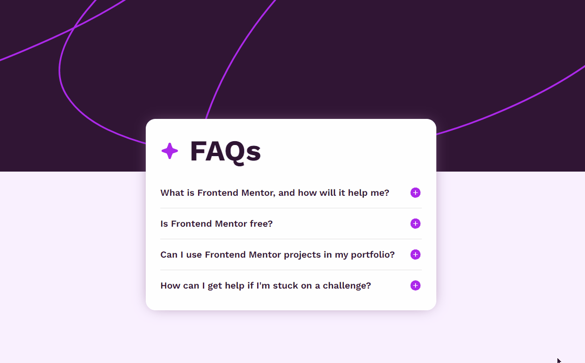

# Frontend Mentor - FAQ accordion solution

This is a solution to the project FAQ accordion.
The project was developed through the challenge of the frontEnd mentor, so I looked for the best practices to execute this project.

## About the challenge

- With this project, users can hide/show the answer to a question when the wuestion is clicked.
- When clicking on the question it will show the answer to each question.
- When clicking on a question, the previous element will.

## Screenshot
  - DESKTOP/MOBILE
   

### Built with
- Semantic HTML5 markup
- CSS with CSS FLEX
- JavaScript
  
### What I learned

In this project I had some difficulties that taught me many things, the first one was in the JavaScript part, I had difficulty executing a simple code, but trying to solve it.

The second was to maintain the design for both desktop and mobile, but I managed to solve it by researching and trying to find out why the error was occurring, and I managed to execute the project.

With this I was able to learn good and simple ways of executing a project that at first was complicated for me, but later I found it simple.